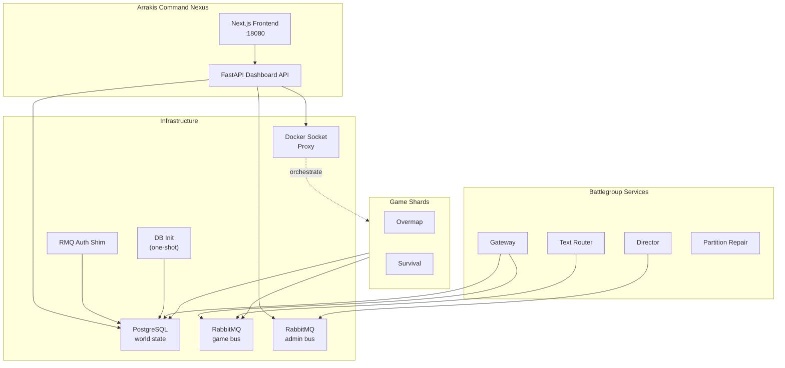

# Dune Awakening Dedicated Server with Docker Compose and Arrakis Command Nexus

[](https://github.com/Manaiakalani/arrakis-command-nexus/releases)
[](https://www.docker.com/)
[](https://docs.docker.com/compose/)
[](https://github.com/Manaiakalani/arrakis-command-nexus/actions/workflows/ci.yml)
[](./LICENSE)
[](./docs/QUICKSTART.md)

Self-host a **Dune Awakening dedicated server** with **Docker Compose**, automatic infrastructure bootstrap, and the **Arrakis Command Nexus** companion dashboard for day-to-day operations.

This project packages PostgreSQL, RabbitMQ, battlegroup services, helper scripts, and a browser-based control plane so you can launch a private or community server without manually wiring every dependency.

In the in-game server browser, self-hosted worlds appear under the **Experimental** tab.

## Dashboard Preview

<p align="center">
  
</p>

<p align="center">
  
  
</p>

## Why This Project?

Funcom's official self-hosting flow involves several services, credentials, and map processes. This repository turns that into a repeatable Docker Compose deployment with:

- **One-command setup and startup** through the `dune` CLI
- **Automatic database bootstrap and partition repair** for smoother restarts
- **Companion dashboard** for admins who want more than raw container logs
- **Profile-based scaling** for basic, standard, and full battlegroups
- **Backup, restore, and update workflows** built around self-hosted operations

## Key Features

### Docker Compose Server Management
- **Docker Compose-first deployment** for the complete Dune Awakening self-hosted stack
- **Profile-based battlegroups** for basic, standard, and full server layouts
- **`dune` CLI tooling** for setup, startup, shutdown, updates, backups, restores, and diagnostics
- **Map management** to start, stop, restart, and back up individual map shards
- **Automatic crash recovery** with health checks, watchdog logic, and partition repair
- **WSL2 support** for Windows hosts running Docker Desktop with Linux containers

### Arrakis Command Nexus Dashboard
- **Companion web dashboard** for browser-based administration and visibility
- **Mobile-friendly** with WCAG-compliant tap targets, responsive layout, iOS safe-area support, and a slide-in nav drawer for phones
- **Player tracking** with online roster, session timers, and kick controls
- **Player connection history** with recent join/leave events, exports, and a dedicated Players history tab
- **Map management views** with shard status, uptime, telemetry, and orchestration shortcuts
- **Live log streaming** with search, filtering, and download support
- **Hagga Basin map management tools** including player map overlays, heatmaps, and click-to-teleport (works for offline characters)
- **Game tweaks** for sandworm behavior, NPC difficulty, mining rates, loot drops, day/night cycle, crafting costs, and hydration
- **Configuration editing** with dropdown selections, drift detection, and human-readable labels
- **Item spawn catalog** with 410+ verified-real Unreal IDs across 6 vehicle types (Sandbike, Buggy, Sandcrawler, Scout/Assault Ornithopter), full ammo + fuel tier ladders, healkits, blood sacks, all crafting components (servoks, capacitors, machinery, fabrics, spice-infused dust ladder T1-T6), schematics, and armor sets  -  every entry cross-checked against live `dune.items` rows
- **Backup and restore workflows** with scheduled backups, retention policies, and recovery operations
- **Scheduled announcements** for recurring or one-time in-game messages
- **Scheduled server restarts** with automatic pre-restart warnings and backup-before-restart
- **Audit trail** for tracking all admin actions, player logins/logouts, config changes, and grants
- **Discord webhooks** with 7 event channels: server-start/stop/crash, player-join/leave, update-available, and `system` (covering scheduled restarts, backup completion/failure, watchdog resource alerts, and admin actions like grants/teleports/kicks/bans)
- **Public status page** for shareable read-only server health
- **Toast notifications** for real-time feedback across all dashboard pages
- **Light and dark mode** with warm sandy light theme and deep dark theme
- **In-game announcements, moderation controls, economy monitoring, and character tools** for live operations

### Security and Operations
- **Local-only admin defaults** unless you intentionally expose the dashboard
- **Token-based authentication** for admin API access
- **Secret file support** for sensitive credentials and tokens
- **Container allowlisting and response redaction** for safer automation
- **Scheduled backups** with configurable retention windows
- **Inventory conflict detection** (`bash scripts/inventory-conflicts.sh [--repair]`)  -  finds duplicate `(inventory_id, position_index)` rows in `dune.items` (the silicon-style ghost bug) and relocates duplicates to free slots. Safe to run on a live server.
- **Repo sanitization check** (`bash scripts/sanitize-check.sh`) blocks accidental commits of internal hostnames, SSH usernames, IPs, JWTs, RMQ secrets, and real Discord webhook URLs. Run with `--staged` as a pre-commit hook, or `--history` to audit past commits.
- **No-hardcoded-host configuration**  -  SSH host hints in the dashboard are driven by `DUNE_SSH_USER`, `DUNE_SSH_HOST`, `DUNE_SERVER_DIR` env vars (placeholders by default), so a fresh public clone never leaks the operator's hostname or username.

## Deployment Profiles

| Profile | Best for | Typical maps | Recommended RAM |
| --- | --- | --- | --- |
| `basic` | Small private groups | Overmap + Survival | ~20 GB |
| `standard` | Most community servers | 9 maps: adds Deep Desert, social hubs, and story shards | ~30-40 GB |
| `full` | Large always-on communities | Expanded Survival, Deep Desert, and story capacity | ~40 GB+ |

See [docs/PROFILES.md](./docs/PROFILES.md) for the exact shard layouts.

## Prerequisites

| Requirement | Details |
| --- | --- |
| **OS** | Linux or Windows 10/11 with WSL2 |
| **Docker** | Docker Engine or Docker Desktop with Docker Compose v2 |
| **CPU** | AVX2 support required |
| **RAM** | 20-40+ GB depending on deployment profile |
| **Storage** | 50+ GB for images, saves, database, and backups |
| **Network** | Public IP, DNS, or router port forwarding for external players |

## Quick Start

```bash
# 1. Download Funcom's dedicated server files (anonymous login works, no game ownership needed)
steamcmd +login anonymous +app_update 4754530 validate +quit

# 2. Clone and configure
git clone https://github.com/Manaiakalani/arrakis-command-nexus.git
cd arrakis-command-nexus
./dune init

# 3. Start the battlegroup
./dune start
```

Typical dashboard endpoints after setup:

- `http://your-server-ip:18080`
- `https://dashboard.your-domain.com`

See [Quick Start](./docs/QUICKSTART.md) for the full Linux and WSL2 walkthrough.

> ⚠️ **Read the [Common Gotchas](./docs/TROUBLESHOOTING.md#common-gotchas-recommended-settings) section before going live.** Funcom's sample `director.ini` ships with a few defaults (most notably `AllowGroupTravel=false`) that produce surprising behaviour on a self-hosted setup  -  e.g. parties dissolving on every reconnect.

## Architecture



## Documentation

| Guide | Description |
| --- | --- |
| [Quick Start](./docs/QUICKSTART.md) | First deployment on Linux or WSL2 |
| [Configuration](./docs/CONFIGURATION.md) | Environment variables, dashboard settings, and config files |
| [Config Keys](./docs/CONFIG_KEYS.md) | Reference for gameplay, engine, and director tuning keys |
| [Design System](./docs/DESIGN.md) | Dashboard design tokens, components, and patterns |
| [Profiles](./docs/PROFILES.md) | Compare basic, standard, and full battlegroups |
| [Map Management](./docs/MAP_MANAGEMENT.md) | Per-map RAM/port reference and start/stop commands |
| [Networking](./docs/NETWORKING.md) | Ports, firewall planning, and NAT hairpin guidance |
| [Troubleshooting](./docs/TROUBLESHOOTING.md) | Common startup, networking, dashboard, and WSL2 issues |
| [Operations](./docs/OPERATIONS.md) | Day-to-day dashboard operations, announcements, backups, and restores |
| [Monitoring](./docs/MONITORING.md) | Watchdog alerts, resource thresholds, and crash forensics |
| [Deployment Notes](./docs/DEPLOYMENT_NOTES.md) | Intel hybrid CPUs, host networking caveats, RAM pressure, and systemd |
| [VM Deployment](./vm/README.md) | Run as a standalone VM (Hyper-V, VirtualBox, Proxmox) |
| [Deep Desert Knobs](./docs/DEEP_DESERT_KNOBS.md) | Focused Deep Desert tuning reference |
| [Resource Respawn Knobs](./docs/RESOURCE_RESPAWN_KNOBS.md) | Resource pacing and respawn-related settings |
| [Security Policy](./SECURITY.md) | Hardening checklist and responsible disclosure |
| [Cloudflare Tunnel](./docs/CLOUDFLARE_TUNNEL.md) | Expose the dashboard over the internet without port forwarding |

## Common CLI Commands

```bash
./dune init        # Interactive setup wizard
./dune start       # Start the full stack
./dune stop        # Stop services
./dune restart     # Restart services
./dune status      # Show container health
./dune dashboard   # Print (and open) the companion dashboard URL
./dune logs        # Tail service logs
./dune backup      # Create a backup snapshot
./dune restore     # Restore from a backup snapshot
./dune update      # Refresh server images
./dune preflight   # Run pre-start validation
./dune doctor      # Diagnose the host environment
```

### Host Optimization

On a multi-map host, in-game rubberbanding is almost always a host-networking or scheduling problem rather than a game bug.

```bash
# Apply Linux kernel tuning (sysctl, THP, Docker daemon)
sudo ./scripts/host-tuning.sh

# Add swap for low-memory hosts
sudo ./scripts/host-tuning.sh --swap 8

# Pin player-facing map servers to dedicated CPU cores (anti-rubberband)
sudo ./scripts/cpu-pin.sh --install

# Optional: generate a host-specific compose overlay (do not commit it)
./scripts/generate-cpupin.sh

# Collect diagnostic snapshot for support
./scripts/collect-snapshot.sh
```

**Key Optimizations for Server Admins:**

- **CPU Performance Mode**: For consistent tick rates, set your CPU frequency governor to `performance`. You can also limit C-states (e.g., `intel_idle.max_cstate=1` in GRUB) to prevent the kernel from parking cores during brief idle periods, which causes micro-stutters when waking up.
- **Intel Hybrid CPU (P-core/E-core)**: If you use a 12th-16th gen Intel or Ultra series CPU, game threads might be scheduled onto E-cores, cratering performance. `./scripts/cpu-pin.sh` auto-detects topology and prefers P-cores; `./scripts/generate-cpupin.sh` can write a machine-local `docker-compose.cpupin.yml`.
- **NIC Tuning**: For high player counts, increase your Network Interface Card ring buffers (`ethtool -G eth0 rx 4096 tx 4096`). Enabling busy polling (`sysctl net.core.busy_poll=50`) and checking GRO/GSO settings can also reduce UDP packet drop.
- **Scheduled Restart Port Wait**: If you use `docker-compose.hostnet-all.yml`, set `PORT_AVAILABILITY_WAIT_SECONDS=30` in your `.env`. Host networking can suffer from port binding races on restart; this delay ensures the old process fully releases the UDP port before the new one binds.

To start the stack automatically on boot, run `sudo ./dune install-service`.
[`scripts/dune-stack.service`](./scripts/dune-stack.service) remains a manual
template for packagers.

## Who Is This For?

- Players who want a private Dune Awakening Docker server at home
- Communities running a persistent self-hosted battlegroup
- Admins who want a Docker Compose workflow plus a polished dashboard
- Operators who need backups, Discord alerts, player visibility, and public status sharing

## Resources

- [Funcom Self-Hosting Docs](https://duneawakening.com/self-hosted-servers/) - Official self-hosting reference

## Contributing

### Local setup

```bash
git clone https://github.com/Manaiakalani/arrakis-command-nexus.git
cd arrakis-command-nexus

# Backend
cd dashboard/backend
python -m venv .venv && source .venv/bin/activate
pip install -r requirements.txt

# Frontend
cd ../frontend
npm ci
```

### Running tests

```bash
# Frontend build check
cd dashboard/frontend && npm run build

# Backend compile check
cd dashboard/backend && python -m py_compile main.py

# Playwright e2e (requires a running dashboard)
cd dashboard/frontend && npx playwright test
```

### Pull request checklist

1. Fork the repo and branch from `main` (`feature/your-change` or `fix/your-fix`).
2. Run `./dune doctor` to verify your local environment.
3. Confirm `npm run build` and `python -m py_compile main.py` pass.
4. Add a changelog entry under `## [Unreleased]` in `CHANGELOG.md`.
5. Open a PR with a clear summary of what changed and why.

## License

MIT
