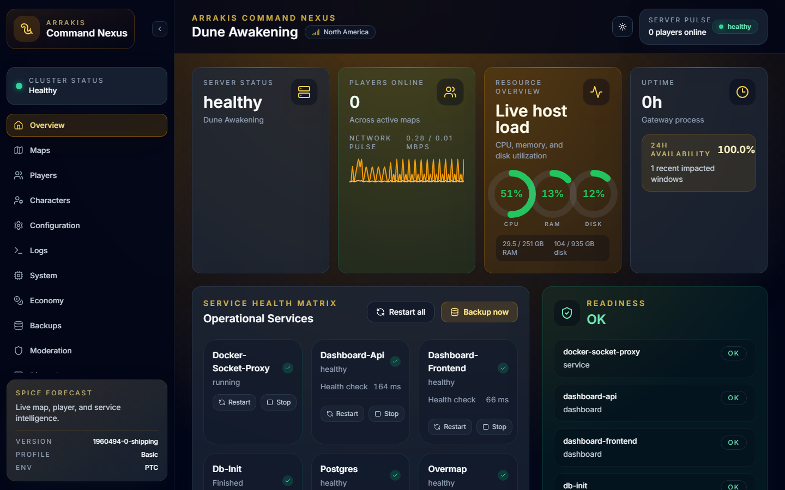
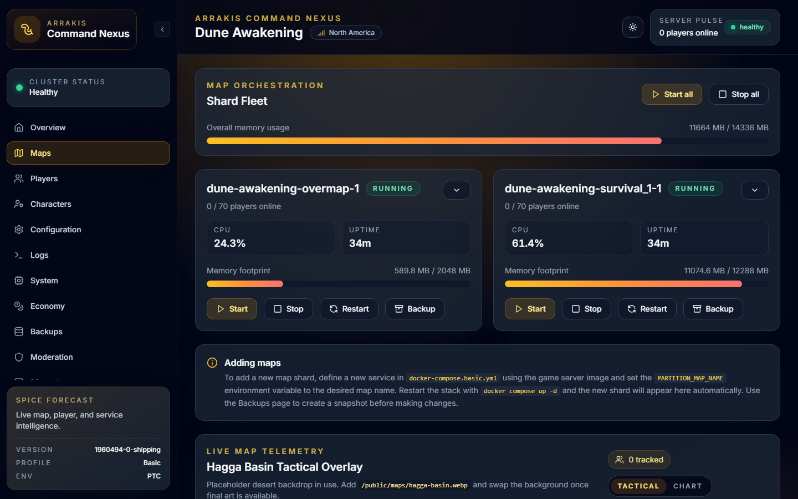
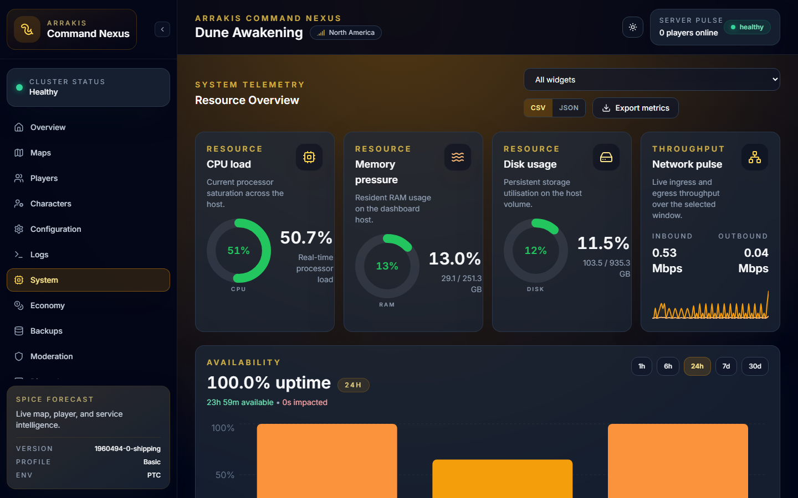

# Dune Awakening Dedicated Server with Docker Compose and Arrakis Command Nexus

[](https://github.com/manailab/dune-server-docker/releases)
[](https://www.docker.com/)
[](https://docs.docker.com/compose/)
[](https://github.com/manailab/dune-server-docker/actions/workflows/ci.yml)
[](./LICENSE)
[](./docs/QUICKSTART.md)

Self-host a **Dune Awakening dedicated server** with **Docker Compose**, automatic infrastructure bootstrap, and the **Arrakis Command Nexus** companion dashboard for day-to-day operations.

This project packages PostgreSQL, RabbitMQ, battlegroup services, helper scripts, and a browser-based control plane so you can launch a private or community server without manually wiring every dependency.

## Dashboard Preview

<p align="center">
  
</p>

<p align="center">
  
  
</p>

## Why This Project?

Funcom's official self-hosting flow involves several services, credentials, and map processes. This repository turns that into a repeatable Docker Compose deployment with:

- **One-command setup and startup** through the `dune` CLI
- **Automatic database bootstrap and partition repair** for smoother restarts
- **Companion dashboard** for admins who want more than raw container logs
- **Profile-based scaling** for basic, standard, and full battlegroups
- **Backup, restore, and update workflows** built around self-hosted operations

## Key Features

### Docker Compose Server Management
- **Docker Compose-first deployment** for the complete Dune Awakening self-hosted stack
- **Profile-based battlegroups** for basic, standard, and full server layouts
- **`dune` CLI tooling** for setup, startup, shutdown, updates, backups, restores, and diagnostics
- **Map management** to start, stop, restart, and back up individual map shards
- **Automatic crash recovery** with health checks, watchdog logic, and partition repair
- **WSL2 support** for Windows hosts running Docker Desktop with Linux containers

### Arrakis Command Nexus Dashboard
- **Companion web dashboard** for browser-based administration and visibility
- **Player tracking** with online roster, session timers, and kick controls
- **Player connection history** with recent join/leave events, exports, and a dedicated Players history tab
- **Map management views** with shard status, uptime, telemetry, and orchestration shortcuts
- **Live log streaming** with search, filtering, and download support
- **Hagga Basin map management tools** including player map overlays and heatmaps
- **Configuration editing** with drift detection for server settings
- **Backup and restore workflows** for snapshots, retention policies, and recovery operations
- **Discord webhooks** for start, stop, crash, join, and leave notifications
- **Public status page** for shareable read-only server health
- **Light and dark mode** support across the dashboard UI
- **In-game announcements, moderation controls, economy monitoring, and character tools** for live operations

### Security and Operations
- **Local-only admin defaults** unless you intentionally expose the dashboard
- **Token-based authentication** for admin API access
- **Secret file support** for sensitive credentials and tokens
- **Container allowlisting and response redaction** for safer automation
- **Scheduled backups** with configurable retention windows

## Deployment Profiles

| Profile | Best for | Typical maps | Recommended RAM |
| --- | --- | --- | --- |
| `basic` | Small private groups | Overmap + Survival | ~20 GB |
| `standard` | Most community servers | Adds Deep Desert, social hubs, and story shards | ~30-40 GB |
| `full` | Large always-on communities | Expanded Survival, Deep Desert, and story capacity | ~40 GB+ |

See [docs/PROFILES.md](./docs/PROFILES.md) for the exact shard layouts.

## Prerequisites

| Requirement | Details |
| --- | --- |
| **OS** | Linux or Windows 10/11 with WSL2 |
| **Docker** | Docker Engine or Docker Desktop with Docker Compose v2 |
| **CPU** | AVX2 support required |
| **RAM** | 20-40+ GB depending on deployment profile |
| **Storage** | 50+ GB for images, saves, database, and backups |
| **Network** | Public IP, DNS, or router port forwarding for external players |

## Quick Start

```bash
# 1. Download Funcom's dedicated server files
steamcmd +login anonymous +app_update 3104830 validate +quit

# 2. Clone and configure
git clone https://github.com/manailab/dune-server-docker.git
cd dune-server-docker
./dune init

# 3. Start the battlegroup
./dune start
```

Typical dashboard endpoints after setup:

- `http://your-server-ip:18080`
- `https://dashboard.your-domain.com`

See [Quick Start](./docs/QUICKSTART.md) for the full Linux and WSL2 walkthrough.

## Architecture

```text
                    +--------------------------+
                    | Arrakis Command Nexus    |
                    | Next.js frontend         |
                    +------------+-------------+
                                 |
                    +------------+-------------+
                    | Dashboard API (FastAPI)  |
                    +------------+-------------+
                                 |
         +-----------------------+------------------------+
         |                       |                        |
+--------+--------+   +----------+---------+   +---------+---------+
| PostgreSQL       |   | RabbitMQ           |   | Docker socket     |
| world state      |   | game/admin traffic |   | orchestration     |
+--------+--------+   +----------+---------+   +---------+---------+
         |                       |                        |
         +-----------------------+------------------------+
                                 |
                    +------------+-------------+
                    | Dune Awakening shards    |
                    | Overmap, Survival, Deep  |
                    | Desert, social, story    |
                    +--------------------------+
```

## Documentation

| Guide | Description |
| --- | --- |
| [Quick Start](./docs/QUICKSTART.md) | First deployment on Linux or WSL2 |
| [Configuration](./docs/CONFIGURATION.md) | Environment variables, dashboard settings, and config files |
| [Config Keys](./docs/CONFIG_KEYS.md) | Reference for gameplay, engine, and director tuning keys |
| [Profiles](./docs/PROFILES.md) | Compare basic, standard, and full battlegroups |
| [Networking](./docs/NETWORKING.md) | Ports, firewall planning, and NAT hairpin guidance |
| [Troubleshooting](./docs/TROUBLESHOOTING.md) | Common startup, networking, dashboard, and WSL2 issues |
| [VM Deployment](./vm/README.md) | Run as a standalone VM (Hyper-V, VirtualBox, Proxmox) |
| [Deep Desert Knobs](./docs/DEEP_DESERT_KNOBS.md) | Focused Deep Desert tuning reference |
| [Resource Respawn Knobs](./docs/RESOURCE_RESPAWN_KNOBS.md) | Resource pacing and respawn-related settings |
| [Security Policy](./SECURITY.md) | Hardening checklist and responsible disclosure |

## Common CLI Commands

```bash
./dune init        # Interactive setup wizard
./dune start       # Start the full stack
./dune stop        # Stop services
./dune restart     # Restart services
./dune status      # Show container health
./dune logs        # Tail service logs
./dune backup      # Create a backup snapshot
./dune restore     # Restore from a backup snapshot
./dune update      # Refresh server images
./dune preflight   # Run pre-start validation
```

## Who Is This For?

- Players who want a private Dune Awakening Docker server at home
- Communities running a persistent self-hosted battlegroup
- Admins who want a Docker Compose workflow plus a polished dashboard
- Operators who need backups, Discord alerts, player visibility, and public status sharing

## Related Projects

- [Funcom Self-Hosting Docs](https://duneawakening.com/self-hosted-servers/) - Official self-hosting reference
- [comfuzio/OpenDune-Director](https://github.com/comfuzio/OpenDune-Director) - Alternative director implementation
- [Nerrowake/sietch-console](https://github.com/Nerrowake/sietch-console) - Console-based management tooling

## Contributing

1. Fork the repository.
2. Create a feature branch.
3. Validate your changes locally.
4. Open a pull request with a clear summary.

## License

MIT
